# KebApp — oceniaj kebaby, znajduj najlepsze miejsca

**KebApp** to mobilna aplikacja na Androida napisana w **Kotlin + Jetpack Compose (Material 3)**.
Łączy **Firebase (Auth + Firestore)**, **Google Maps**, **geokodowanie (Retrofit)** i **GPS**. Umożliwia użytkownikom:
- przeglądanie i sortowanie listy restauracji (po **nazwie**, **ocenie** i **odległości**),
- filtrowanie po **promieniu od użytkownika**,
- **mapę** z markerami kolorowymi wg średniej oceny oraz markerem pozycji użytkownika,
- dodawanie **recenzji aspektowych** (smak, jakość, lokal, stosunek jakość/cena, komentarz, „czy powtórzyłbym?”) i średnich,
- dodawanie **nowych restauracji** (adres → geokodowanie → dzługość/szerokość geograficzna),
- oznaczanie **ulubionych** (persistowane w Firestore przy użytkowniku),
- logowanie/rejestrację/reset hasła (Firebase Auth, e‑mail/hasło),
- **zarządzanie językiem UI** (PL/EN/DE) i **motywem** (systemowy, jasny, ciemny),
- **panel admina**: zatwierdzanie/odrzucanie restauracji w statusie *pending* oraz przegląd/usuwanie opinii.

> Aplikacja prowadzi użytkownika przez startowy **flow uprawnień i GPS** (runtime permission + włączanie lokalizacji) zanim uruchomi właściwy interfejs.

## KebApp — Galeria

<p align="center">
  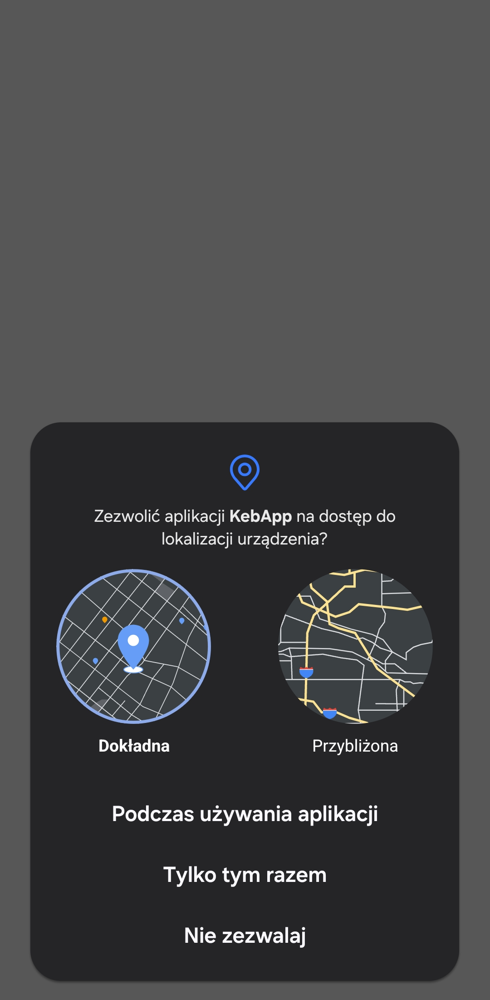
  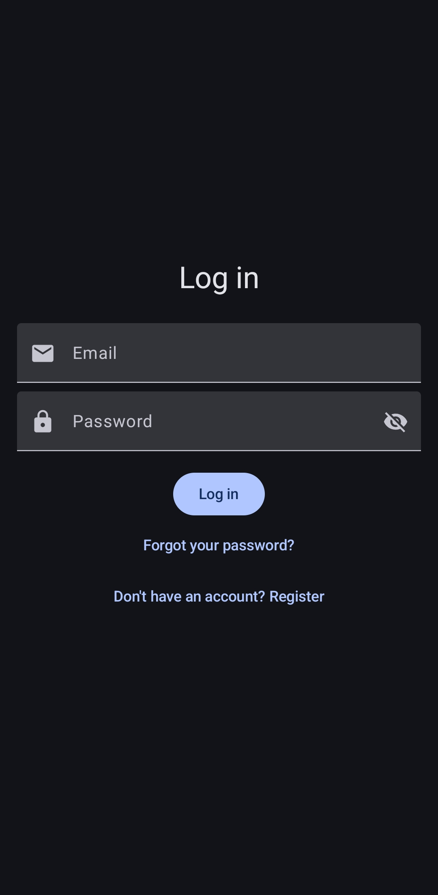
  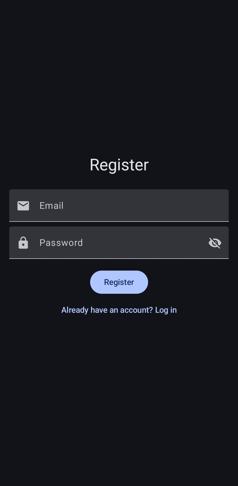
  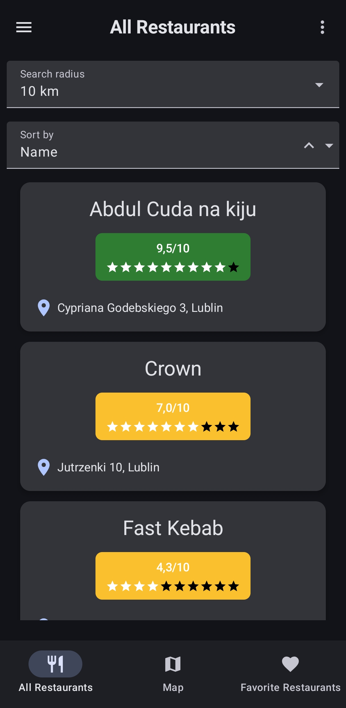
  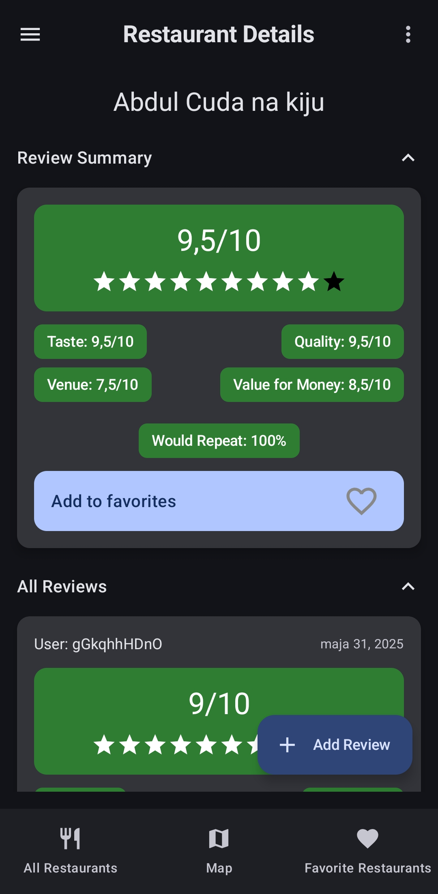
</p>

<p align="center">
  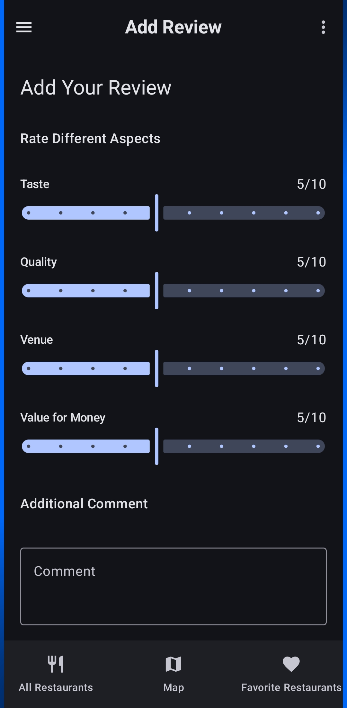
  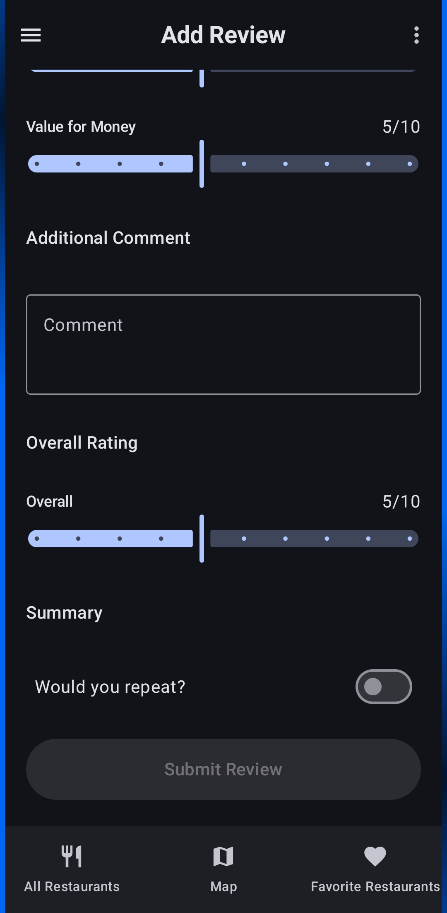
  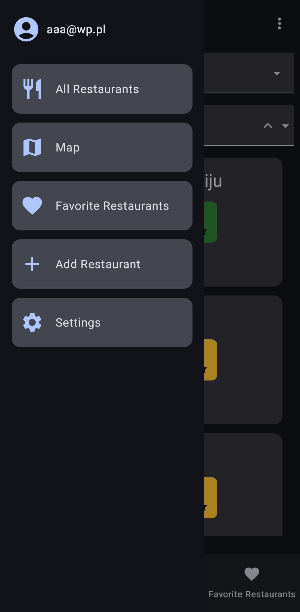
  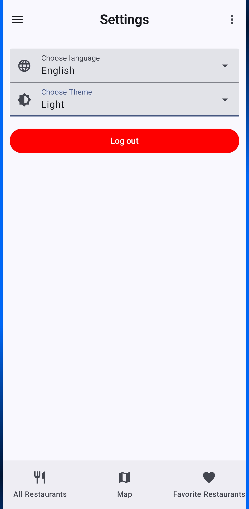
  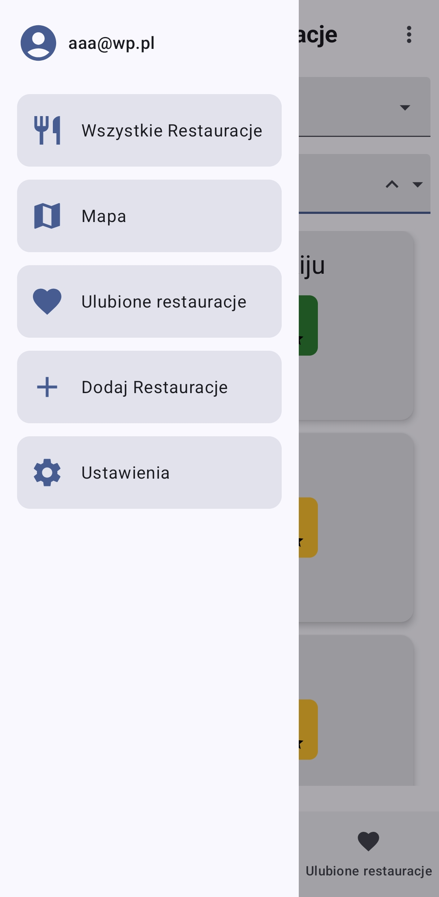
</p>

<p align="center">
  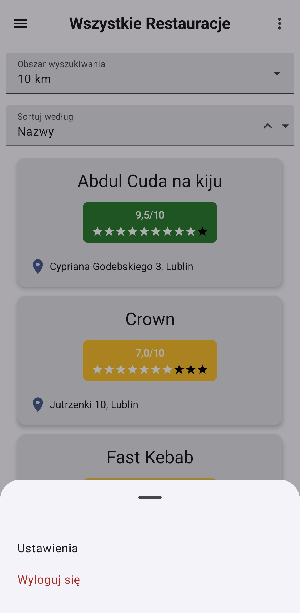
  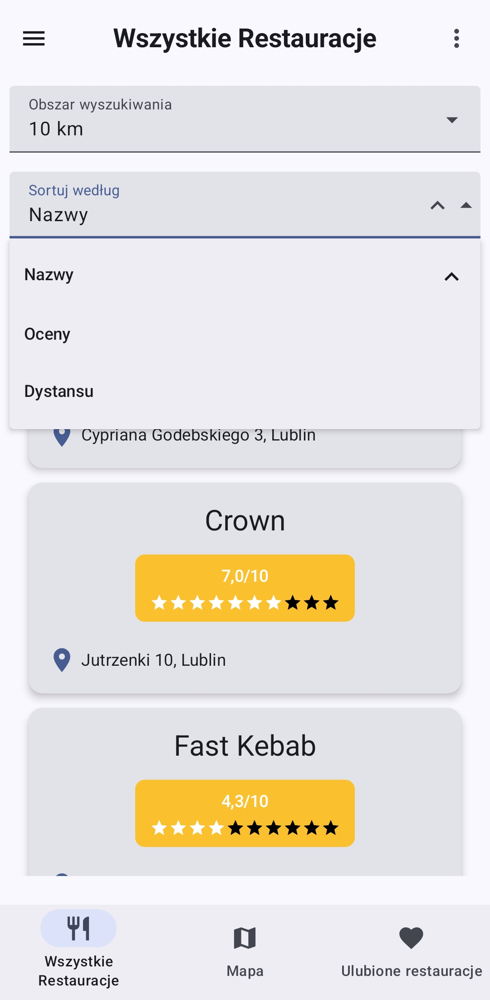
  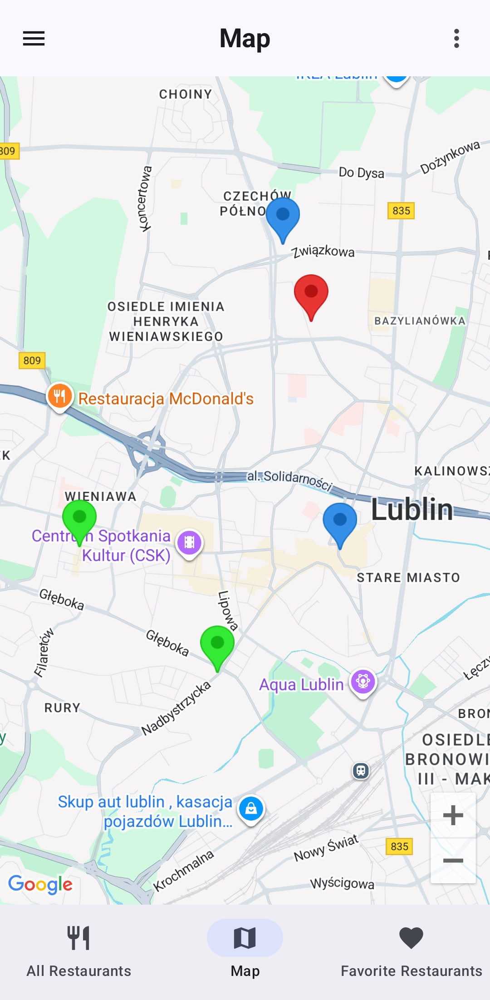
  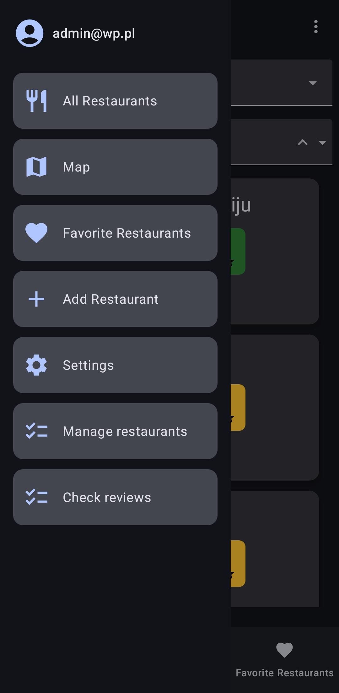
  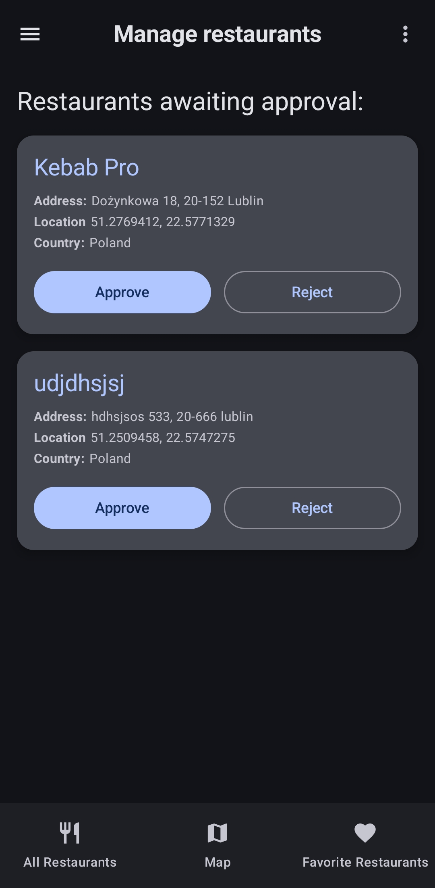
</p>


---

## Spis treści
1. [Architektura](#architektura)
2. [Warstwa danych i modele](#warstwa-danych-i-modele)
3. [Nawigacja](#nawigacja)
4. [Widoki i komponenty kluczowe](#widoki-i-komponenty-kluczowe)
5. [Uprawnienia, lokalizacja i mapa](#uprawnienia-lokalizacja-i-mapa)
6. [Ulubione, sortowanie i filtrowanie](#ulubione-sortowanie-i-filtrowanie)
7. [Lokalizacja językowa i motyw](#lokalizacja-językowa-i-motyw)
8. [Role użytkowników i funkcje admina](#role-użytkowników-i-funkcje-admina)
9. [Integracje i konfiguracja środowiska](#integracje-i-konfiguracja-środowiska)
10. [Struktura kolekcji w Firestore](#struktura-kolekcji-w-firestore)
11. [Uruchomienie (krok po kroku)](#uruchomienie-krok-po-kroku)
12. [Bezpieczeństwo i dobre praktyki](#bezpieczeństwo-i-dobre-praktyki)
13. [Testowanie funkcjonalne – checklisty](#testowanie-funkcjonalne--checklisty)
14. [Rozszerzenia i TODO](#rozszerzenia-i-todo)
15. [Autor](#Autor)

---

## Architektura

**Warstwy / pakiety** (najważniejsze):
- `view.*` – ekrany composable (auth, main, mapa, restauracje, ustawienia), mniejsze komponenty UI.
- `viewmodel.*` – logika prezentacji w oparciu o **StateFlow** i **coroutines** (AuthViewModel, RestaurantsViewModel, LocationViewModel).
- `model.*` – modele: `Restaurant`, `Review`, typy sortowania.
- `location.*` – dostęp do lokalizacji (uprawnienia, włączanie GPS, provider oparty o FusedLocationProvider + Flow).
- `map.*` – Retrofit + Gson do **Google Geocoding API**.
- `locale.*` – dynamiczna zmiana języka w Compose (`LocaleProvider`, `LocalAppLocale`).
- `ui.theme.*` – motyw, kolory i **ThemePreferences (DataStore)**.
- `navigation.*` – struktura tras (AuthNavigation, MainNavigation, `Screen` sealed class).

**Przepływ startowy** (`AppEntry`):
1. `StartupState.RequestingPermission` → `LocationPermissionRequest(...)`
2. `StartupState.RequestingGps` → `LocationSettingsRequest(...)`
3. Po sukcesie: `LocaleProvider { LoginFlowController(...) }` → auth lub główny UI.

---

## Warstwa danych i modele

**Restaurant** (`model/Restaurant.kt`)
- Id (Firestore doc id), dane adresowe, współrzędne `latitude/longitude` (nullable do momentu geokodowania),
- `averageRating` – utrzymywane na *dokumencie restauracji* po dodaniu/usunięciu opinii,
- `status` – `"pending" | "approved" | "rejected"` (moderacja przez admina),
- metody pomocnicze: `fullAddress()`.

**Review** (`model/Review.kt`)
- `tasteRating`, `qualityRating`, `venueRating`, `valueForMoneyRating`, `overallRating` (1–10),
- `comment`, `wouldRepeat` (bool), `timestamp`,
- `userID` (uid użytkownika Firebase).

**Enums – sortowanie** (`model.enums`):
- `SortType`: `NAME`, `RATING`, `DISTANCE` + `SortOption(ascending: Boolean)`.

**Form state** (`RestaurantsViewModel`):
- `ReviewFormState`, `AddRestaurantFormState` (+ walidacje i błędy `RestaurantFormErrors`).

---

## Nawigacja

**AuthNavigation** (gdy nie zalogowany): `LoginView` ↔ `RegisterView`.  
Po zalogowaniu → **MainContent** z `MainNavigation`:

Główne trasy:
- `AllRestaurantScreen` – lista.
- `MapScreen` – mapa.
- `FavoriteRestaurantsScreen` – ulubione.
- `RestaurantDetailsScreen/{restaurantId}` – detale + recenzje.
- `AddReviewScreen/{restaurantId}` – dodanie opinii.
- `AddRestaurantScreen` – dodanie restauracji.
- `SettingsScreen` – język + motyw.
- (Admin) `PendingRestaurantsScreen` – zatwierdzanie.
- (Admin) `AdminReviewsScreen` – lista wszystkich opinii z możliwością usunięcia.

TopBar (menu/hamburger) + BottomBar (3 główne zakładki). BottomSheet z szybkim przejściem do ustawień i wylogowaniem.

---

## Widoki i komponenty kluczowe

- **Lista restauracji** (`RestaurantListView`)
  - `DistanceSelector` (1–25 km), `SortDropdown` (nazwa/ocena/odległość + kierunek),
  - lista `RestaurantCard` (nazwa, adres, badge średniej oceny lub „no ratings yet”).

- **Mapa** (`MapView`)
  - pozycja użytkownika (marker `user_location`),
  - markery restauracji z kolorem wg średniej oceny (zielony/żółty/czerwony; brak – niebieski),
  - dolny *sheet-like* podgląd wybranej restauracji: nazwa, średnia, adres, przycisk „Pokaż opinie” i ikonka **ulubionych**.

- **Detale restauracji** (`RestaurantDetailsView`)
  - `SummarySection` (średnie z aspektów, odsetek „powtórzyłbym”, przycisk **Ulubione**),
  - `ExpandableSection` z listą wszystkich opinii (`ReviewCard`),
  - FAB „Dodaj opinię”.

- **Dodawanie opinii** (`AddReviewView`)
  - suwaki 1–10 (`RatingSlider`), komentarz, przełącznik „czy powtórzyłbym”, walidacja długości komentarza, zapis do subkolekcji `reviews`.

- **Dodawanie restauracji** (`AddRestaurantView`)
  - formularz adresu + walidacja (regexy: kod `XX-XXX`, nr typu `4A`, itp.),
  - **geokodowanie** adresu (Retrofit do Google Geocoding API) → zapis w Firestore z `status="pending"`.

- **Ulubione** (`FavoriteRestaurantsView`)
  - przefiltrowana lista wg identyfikatorów w polu `users/{uid}.favorites`.

- **Panel admina**:
  - `PendingRestaurantsView` – card z danymi restauracji i przyciskami **Approve/Reject** (aktualizacja pola `status`),
  - `AdminReviewsView` – płaska lista wszystkich opinii (posortowana malejąco po dacie) z przyciskiem **Delete** (usuwa dokument w subkolekcji).

- **Ustawienia** (`SettingsView`)
  - `LanguageDropdown` (PL/EN/DE) – zapis wybranego `Locale` przez `LocaleManager` w `SharedPreferences` i odświeżenie kontekstu przez `LocaleProvider`,
  - `ThemeDropdown` – zapis w **DataStore** (`ThemePreferences`), `AppTheme`: SYSTEM/LIGHT/DARK,
  - przycisk **Wyloguj** – `AuthViewModel.logout()`.

---

## Uprawnienia, lokalizacja i mapa

- **Runtime permission**: `ACCESS_FINE_LOCATION` – `LocationPermissionRequest` (ActivityResult API).
- **Wymuszenie GPS**: `LocationSettingsRequest` (Google Play Services `SettingsClient`) z obsługą `ResolvableApiException` i fallbackiem do ustawień systemowych.
- **Pobieranie pozycji**: `LocationProvider` (FusedLocationProviderClient) → `Flow<Location>` (updates co 5–10 s). VM: `LocationViewModel.locationFlow` (StateFlow<Location?>).
- **Google Maps**: `GoogleMap` Compose, `Marker` dla restauracji i użytkownika, po kliknięciu w marker pokazujemy „podgląd” i CTA do detali.

---

## Ulubione, sortowanie i filtrowanie

- **Ulubione**: `RestaurantsViewModel.favorites: StateFlow<Set<String>>` – wczytywane i zapisywane w `users/{uid}.favorites`.
- **Filtrowanie po promieniu**: selektor 1–25 km; jeśli lokalizacja nieznana → pusta lista (świadomie).
- **Sortowanie**:
  - *NAME*: rosnąco/malejąco,
  - *RATING*: domyślnie malejąco (najlepsze pierwsze),
  - *DISTANCE*: wymaga lokalizacji; sortuje po metrach z `Location.distanceBetween(...)`.

---

## Lokalizacja językowa i motyw

- **Języki**: PL, EN, DE. `LocaleProvider` przełącza `LocalContext` i `LocalAppLocale` w Compose (bez restartu Activity).
- **Motyw**: `ThemeWrapper` + `ThemePreferences (DataStore)` – wsparcie SYSTEM/LIGHT/DARK. Dedykowane palety kolorów dla obu trybów + dynamiczne kolory (Android 12+).

---

## Role użytkowników i funkcje admina

- Po zalogowaniu `AuthViewModel.loadUserRole()` pobiera z `users/{uid}.role`.
- W Drawer/Navigation ukryte/ujawnione ścieżki admina:
  - **PendingRestaurantsScreen**, **AdminReviewsScreen**.
- Uprawnienia admina ograniczają się do moderacji statusów restauracji i usuwania opinii.

---

## Integracje i konfiguracja środowiska

### 1) Firebase
- Włącz **Authentication → Email/Password**.
- Włącz **Firestore** (tryb produkcyjny; ustaw reguły odpowiednio).
- Struktura dokumentów: patrz [Struktura Firestore](#struktura-kolekcji-w-firestore).
- Pobierz `google-services.json` i umieść w `app/`.
- Dodaj w `build.gradle` plugin `com.google.gms.google-services` i zależności do `firebase-auth` i `firebase-firestore`.

### 2) Google Maps & Geocoding
- Uzyskaj klucze **Maps SDK for Android** i **Geocoding API**.
- W `AndroidManifest.xml` dodaj:
  ```xml
  <meta-data
      android:name="com.google.android.geo.API_KEY"
      android:value="@string/google_maps_key" />
  ```
- Klucz **Geocoding API** nie powinien być w kodzie – przenieś do backendu / proxy lub skonfiguruj bezpieczne ograniczenia (SHA‑1 + pakiet, IP, itp.).

### 3) Uprawnienia w `AndroidManifest.xml`
```xml
<uses-permission android:name="android.permission.ACCESS_FINE_LOCATION" />
<uses-permission android:name="android.permission.ACCESS_COARSE_LOCATION" />
<uses-permission android:name="android.permission.INTERNET" />
```

### 4) Zależności (skrót)
- Jetpack Compose (Material3), Navigation Compose,
- Google Maps Compose + Play Services Location,
- Kotlin Coroutines + Flow,
- Firebase Auth, Firebase Firestore, Google Services Gradle plugin,
- Retrofit + Gson Converter,
- DataStore Preferences.

---

## Struktura kolekcji w Firestore

```
users/{uid} = { email: string, role: "user" | "admin", favorites: [restaurantId, ...] }

restaurants/{restaurantId} = {
  name, street, streetNumber, postalCode, city, country,
  latitude, longitude, averageRating, status: "pending" | "approved" | "rejected"
}

restaurants/{restaurantId}/reviews/{reviewId} = {
  userID, timestamp, tasteRating, qualityRating, venueRating, valueForMoneyRating,
  overallRating, comment, wouldRepeat
}
```

> `averageRating` jest przeliczane po dodaniu/usunięciu opinii (`RestaurantsViewModel.updateAverageRating`).

---

## Uruchomienie (krok po kroku)

1. **Skonfiguruj projekt Firebase**, pobierz `google-services.json` → `app/`.
2. **Włącz Auth (email/hasło)** i **Firestore** w konsoli Firebase.
3. **Wklej klucz Map** do `strings.xml` (`google_maps_key`) i dodaj meta‑data w `AndroidManifest.xml`.
4. **Skonfiguruj Geocoding**: używaj bezpiecznie (proxy/backend) – nie commituj klucza w kodzie.
5. Zbuduj projekt w Android Studio (Giraffe+), minSdk zgodnie z ustawieniami projektu (Compose).
6. Uruchom na urządzeniu z włączonym **GPS** i udziel dostęp do lokalizacji.
7. **Zarejestruj konto**, zaloguj się, przetestuj dodawanie restauracji/opinii.

---

## Bezpieczeństwo i dobre praktyki

- **Nigdy nie przechowuj klucza Geocoding API w repozytorium** – użyj serwera pośredniczącego lub ograniczeń klucza (IP/sha‑1, limity).
- Zdefiniuj **reguły Firestore**:
  - użytkownik może odczytać restauracje `status="approved"`,
  - dodawać recenzje tylko zalogowany użytkownik i modyfikować swoje opinie,
  - lista `users/{uid}.favorites` — zapisy tylko przez właściciela dokumentu,
  - operacje **admin** tylko dla roli `"admin"`.
- Waliduj wejścia również po stronie serwera/reguł (zakres ocen, długości komentarzy).
- Rozważ **Cloud Functions** do przeliczania `averageRating` transakcyjnie, aby wyeliminować wyścigi.

---

## Testowanie funkcjonalne – checklisty

**Start i lokalizacja**
- [ ] Odmowa uprawnienia → ekran „włącz uprawnienie”.
- [ ] Brak GPS → dialog lub ekran „włącz GPS”.
- [ ] Po akceptacji obu → wchodzi do aplikacji.

**Lista / sortowanie / filtr**
- [ ] Zmiana promienia (1–25 km) wpływa na wyniki.
- [ ] Sortowanie po nazwie, ocenie (malejąco domyślnie), odległości.

**Mapa**
- [ ] Mapa ładuje się, marker użytkownika i restauracji widoczne.
- [ ] Podgląd po kliknięciu markera działa, przejście do detali OK.

**Detale i recenzje**
- [ ] Brak recenzji → informacja „brak recenzji”.
- [ ] Dodanie recenzji (1–10, komentarz 5–500 znaków) – pojawia się na liście.
- [ ] Usunięcie recenzji przez admina – znika, średnia się aktualizuje.

**Ulubione**
- [ ] Toggling ulubionych działa i utrzymuje się po restarcie (Firestore).

**Dodanie restauracji**
- [ ] Walidacje formularza (regexy).
- [ ] Geokodowanie poprawnego adresu → `status="pending"` w Firestore.
- [ ] Widoczna na liście dopiero po approve admina.

**Ustawienia**
- [ ] Zmiana języka bez restartu Activity.
- [ ] Zmiana motywu (system/jasny/ciemny) zapisywana w DataStore.

**Role i uprawnienia**
- [ ] Użytkownik z rolą `admin` widzi ekrany Pending/AdminReviews.
- [ ] Zwykły użytkownik nie ma do nich dostępu.

---

## Rozszerzenia i TODO

- [ ] Przenieść geokodowanie do backendu (Cloud Functions + sec rules).
- [ ] Wydzielić Repozytoria dla Firestore/Geocoding, dodać DI (Hilt).
- [ ] Dodanie zdjęć restauracji/opinii (Firebase Storage).
- [ ] Wsparcie offline (Room cache, Sync).

---

### Załączniki techniczne (odniesienia do kodu)

- **Locale**: `locale/LocaleManager.kt`, `locale/LocaleProvider.kt`, `locale/LocalAppLocale.kt`
- **Location**: `location/LocationPermissionRequest.kt`, `LocationSettingsRequest.kt`, `LocationProvider.kt`
- **Geocoding**: `map/GeocodingApi.kt`, `GeocodingService.kt` (Retrofit)
- **Modele**: `model/Restaurant.kt`, `model/Review.kt`, `model/enums/*`
- **Nawigacja**: `navigation/AuthNavigation.kt`, `MainNavigation.kt`, `Screen.kt`
- **UI**: `view/*` (auth, main, map, restaurants, settings), komponenty w `view/.../components`
- **Tematy**: `ui/theme/*` (KebAppTheme, ThemeWrapper, ThemePreferences, kolory)
- **VM**: `viewmodel/AuthViewModel.kt`, `RestaurantsViewModel.kt`, `LocationViewModel.kt`
- **Entry**: `AppEntry.kt`, `MainActivity.kt`

## Autor

Created by Mateusz Turowicz

